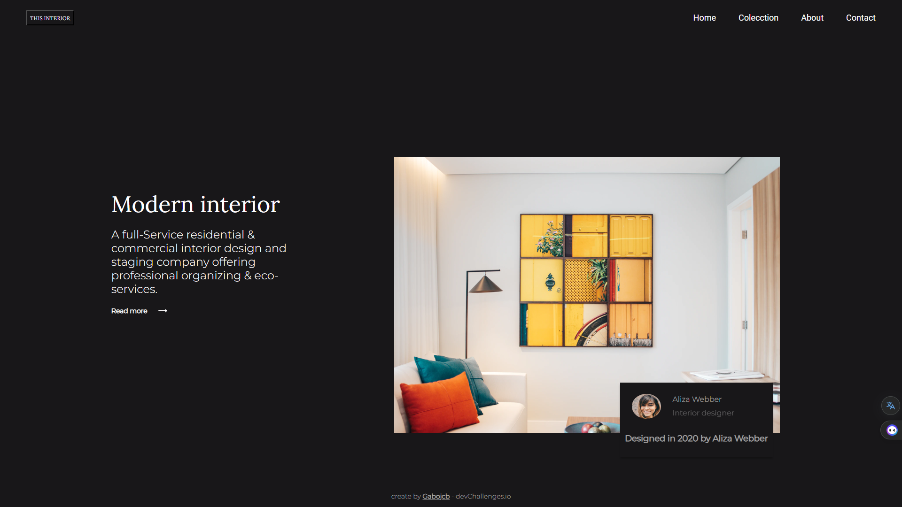

<!-- Please update value in the {}  -->

<h1 align="center">Interior Consultant Master</h1>

   Solution for a challenge from  <a href="http://devchallenges.io" target="_blank">Devchallenges.io</a>.

  <h3>
    <a href="https://{your-demo-link.your-domain}">
      Demo
    </a>
     | 
    <a href="https://{your-url-to-the-solution}">
      Solution
    </a>
     | 
    <a href="https://devchallenges.io/challenges/Jymh2b2FyebRTUljkNcb">
      Challenge
    </a>
  </h3>

<!-- TABLE OF CONTENTS -->

## Overview

### Built With

-   [React](https://reactjs.org/)
-   [Sass](https://sass-lang.com/)
-   [BeyondJS] (https://beyondjs.com/)

## Features

<!-- List the features of your application or follow the template. Don't share the figma file here :) -->

This application/site was created as a submission to a [DevChallenges](https://devchallenges.io/challenges) challenge.
The [challenge](https://devchallenges.io/challenges/Jymh2b2FyebRTUljkNcb) was to build an application to complete the
given user stories.

## Acknowledgements

<!-- This section should list any articles or add-ons/plugins that helps you to complete the project. This is optional but it will help you in the future. For exmpale -->

-   [Steps to replicate a design with only HTML and CSS](https://devchallenges-blogs.web.app/how-to-replicate-design/)
-   [Node.js](https://nodejs.org/)
-   [Marked - a markdown parser](https://github.com/chjj/marked)

## Contact

-   GitHub [@Gabojcb](https://github.com/Gabojcb)
-   Twitter [@gabrieljcb31](https://twitter.com/Gabrieljcb31)
